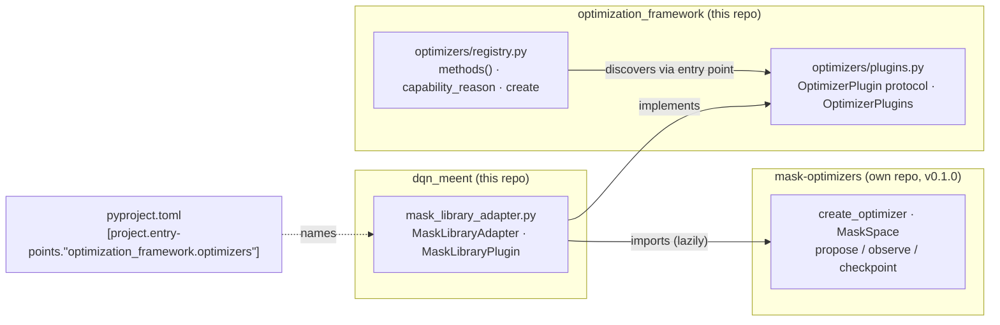

# Optimizer libraries and plug-ins

**Status:** adopted 2026-10-07. **Applies to:** every optimizer that is not part of
`optimization_framework` itself, starting with [`mask-optimizers`](https://github.com/kc-ml2/mask-optimizers).

## The decision in five lines

1. Reusable optimizer code lives in **its own versioned package and repository**, with no knowledge of Balsamic.
2. The project that wants it adds a small **adapter** that translates between the package and the project's problem.
3. The adapter **registers itself** through a Python entry point in the `optimization_framework.optimizers` group.
4. The framework **discovers** registered methods; it never imports a library or adapter by name.
5. The project pins the package (`masks` extra, git tag, lock file), and frozen runs record which plug-in and library version produced each result.

The rest of this document explains why each line exists, how the pieces fit at run time, and how to apply the
pattern to the next library.

## The problem this solves

Before this change, `optimization_framework/optimizers/registry.py` contained:

```python
MASK_LIBRARY_METHODS = {"motif_surgery", "nested_fourier", "phenotype_de"}
...
if name in MASK_LIBRARY_METHODS:
    from dqn_meent.mask_library_adapter import MaskLibraryAdapter
```

Three things were wrong with that, and each is a general hazard:

| Symptom | General hazard |
|---|---|
| The general framework imported one project's module (`dqn_meent...`). | **Dependency points the wrong way.** A second project could not use the framework without also carrying `dqn_meent`, and every new library meant editing the framework. |
| The library existed only as a local wheel, not declared in `pyproject.toml`. | **Unreproducible environment.** A fresh clone failed 13 tests, and `uv sync` silently uninstalled the library. |
| Method lists, parameter schemas and validation for the library lived in the framework. | **Knowledge in the wrong place.** Whoever changed the library also had to change the framework. |

## The pattern: three layers and one seam



Read the arrows as "knows about". The **library** knows about nothing. The **adapter** knows about the
library and the framework's contract. The **framework** knows only its own contract. Its single connection to the
adapter is a string in package metadata, the **seam**.

This is the [dependency inversion principle](https://en.wikipedia.org/wiki/Dependency_inversion_principle)
applied to packaging. The framework owns the interface (`OptimizerPlugin`), and concrete implementations depend on
it, not the other way round. It is also a small instance of
[ports and adapters](https://alistair.cockburn.us/hexagonal-architecture/): the plug-in contract is the port, and
`MaskLibraryPlugin` is an adapter.

### What belongs in each layer

| Layer | Depends on | Knows | Lives in | Example here |
|---|---|---|---|---|
| **Generic library** | NumPy-level packages only | Arrays, scalars, callbacks; its own checkpoint format | Its own repo, tagged releases | `mask-optimizers`: x-major masks, maximize a scalar utility |
| **Domain toolbox** | Generic libraries and a domain package (e.g. MEENT) | Physics or domain data types, but not Balsamic | Its own repo once two projects use it | None yet; MEENT-specific evaluators or decoders would qualify |
| **Project adapter / plug-in** | The library or toolbox and the framework contract | Both sides' conventions; translates between them | The project | `dqn_meent/mask_library_adapter.py` |
| **Framework** | Nothing project-specific | Its contracts, discovery and provenance | `optimization_framework` | `optimizers/plugins.py`, `optimizers/registry.py` |

The test for "is this in the right layer?" is to ask **what would have to change if X changed**:

- If MEENT's grid order changed, only the adapter's `_to_campaign`/`_to_library` should change. Translation belongs at the boundary.
- If the framework's descriptor format changed, only `MaskLibraryPlugin.methods()` should change. The library is untouched.
- If the library gained a method, the library and one line of the adapter's `METHODS` change. The framework is untouched.

### Generic library, domain toolbox, or project code?

Answer these questions in order for each new piece of optimizer code:

1. **Does it import a simulator, a physics model, or a Balsamic type?** If not, and its interface is numbers, arrays
   and callbacks, it is **generic**. `mask-optimizers` passes this test: the caller supplies `score` and, for
   gradient methods, a `relaxed_gradient` callback.
2. **Does it need domain types but not Balsamic?** Then it is a **domain toolbox**.
3. **Does it need Balsamic's contracts** (`ProblemInstance`, `Proposal`, campaign records)? Then it is **adapter or
   project code**, and it stays in the project.

Then decide **where** it lives with the *rule of two*. Code with one user stays in that project, written so it
obeys
the dependency rule, so that extraction later is a move, not a rewrite. When a second project needs it, move it to
its own repository with its tests and validation evidence, as `mask-optimizers` carries
`reports/standalone-validation-20260930/`.

Libraries produced by agents in implementation workspaces follow the same path. A validated implementation in the
campaign library is a candidate. Promoting it to a package is a researcher decision, made once the code passes the
questions above.

## The seam: Python entry points

An [entry point](https://packaging.python.org/en/latest/specifications/entry-points/) is a name → `module:object`
mapping that a package records in its installed metadata. Anyone can enumerate a group without importing anything:

```toml
# pyproject.toml of the package that provides the plug-in
[project.entry-points."optimization_framework.optimizers"]
mask_optimizers = "dqn_meent.mask_library_adapter:MaskLibraryPlugin"
```

```python
from importlib import metadata
metadata.entry_points(group="optimization_framework.optimizers")
# -> [EntryPoint(name='mask_optimizers', value='dqn_meent.mask_library_adapter:MaskLibraryPlugin', ...)]
```

pytest plug-ins and console scripts use the same mechanism, described in the Python Packaging guide
[Creating and discovering plugins](https://packaging.python.org/en/latest/guides/creating-and-discovering-plugins/).
This repository already used it for problems (`optimization_framework.problems`), inference adapters and recipes.
Optimizers now follow the same convention.

Three consequences to remember:

- **Listing is free; loading is not.** `entry_points()` reads metadata only, while `.load()` imports the module.
  The framework loads plug-ins on first use (`registry.methods()`), never at import, so services start without
  importing numerical packages. `tests/test_framework_contracts.py::test_application_starts_with_numerical_domain_imports_blocked`
  enforces this. The first draft of this change loaded plug-ins at import and failed that test, so keep it in mind
  when you add a registry.
- Entry points are recorded **at install time**. After adding or renaming one, run `uv sync`; an editable install
  does not see new entry points until then.
- The framework imports only the module named in metadata, and only an administrator can change it. Model output
  selects **method IDs**, never import paths.

## The contract

`optimization_framework/optimizers/plugins.py` defines what a plug-in must provide:

```python
class OptimizerPlugin(Protocol):
    def methods(self) -> list[dict]: ...                 # method descriptors
    def unavailable_reason(self) -> str | None: ...      # e.g. "Install mask-optimizers 0.1.0 ..."
    def validate(self, name, instance, parameters): ...  # raise ValueError for invalid values
    def create(self, name, instance, parameters, seed): ...  # an optimizer object
```

A descriptor carries `id`, `name`, `description`, `representations`, `constraints`, `parameters` and
`parameter_properties` (JSON Schema properties). It may also carry `problem_ids` and `completion_units`. The
framework then adds the parts it owns: the `optimizer_v1` contract fields, the closed `parameter_schema`, and the
execution capabilities (`registry._declare`). A plug-in describes **what its methods accept**, and the framework
decides **how they execute**.

The optimizer that `create` returns follows the framework's ask/tell lifecycle: `propose`, `observe`,
`checkpoint`, `restore`, `inspect`, `export_artifacts` and `close`. `MaskLibraryAdapter` wraps the library's own
optimizer and converts candidates between x-major and y-major order on the way in and out.

The whole plug-in for the mask library is about 20 lines:

```python
class MaskLibraryPlugin:
    def methods(self):
        return [{"id": name, "name": title, "description": "Standalone mask-optimizers method on the 2D MEENT grid.",
                 "problem_ids": ["meent_2d_dual_polarization_deflector"], "representations": ["binary"],
                 "constraints": False, "parameters": {}, "parameter_properties": PROPERTIES[name]}
                for name, title in METHODS.items()]

    def unavailable_reason(self):
        return None if library_available() else f"Install mask-optimizers {LIBRARY_VERSION} before using this campaign method"

    def validate(self, name, instance, parameters):
        if parameters.get("modes_x", 8) > 16 or parameters.get("modes_y", 4) > 8:
            raise ValueError("Mask-library Fourier modes exceed the supported basis")

    def create(self, name, instance, parameters, seed):
        return MaskLibraryAdapter(name, instance, parameters, seed)
```

### Failure policy

| Situation | Behavior | Why |
|---|---|---|
| Service start | No plug-in is imported until a method is listed or used | The API process stays free of numerical imports; see "Listing is free; loading is not". |
| Library not installed | Module still imports; `unavailable_reason()` explains; the method shows as unavailable | Optional components must never break startup. `mask_library_adapter` imports `mask_optimizers` only inside functions. |
| Plug-in object lacks a contract method or descriptor key | Loading raises `ValueError` | A malformed plug-in is a packaging bug. Silently dropping methods would change what a campaign can reproduce. |
| Two plug-ins, or a plug-in and a bundled method, claim the same ID | Loading raises `ValueError` | An ID must mean one implementation, or recorded results become ambiguous. |
| Parameters outside the schema | Rejected by the framework before `validate` is called | The schema is closed (`additionalProperties: false`). |

## What happens at run time

```mermaid
sequenceDiagram
    participant Svc as Workspace service
    participant Reg as optimizers.registry
    participant Plg as plugins.installed
    participant Prov as execution.provenance
    participant W as Frozen worker
    Svc->>Reg: import (startup): bundled methods only
    Svc->>Reg: methods() on first listing request
    Reg->>Plg: methods()
    Plg->>Plg: read entry points, import adapter, validate descriptors
    Reg-->>Svc: bundled + plug-in methods (cached per plug-in registry)
    Svc->>Reg: capability_reason("motif_surgery", problem)
    Reg->>Plg: get(id) -> unavailable_reason()
    Svc->>Prov: capture(trial directory)
    Prov->>Prov: snapshot source; trace imports from roots incl. plug-in modules
    Prov-->>Svc: manifest with optimizer_entry_points, scientific digest, library versions
    Svc->>W: launch trial
    W->>W: OptimizerPlugins(manifest["optimizer_entry_points"])
    W->>Reg: create(..., optimizer_plugins=captured)
    Reg-->>W: MaskLibraryAdapter -> mask_optimizers optimizer
```

### Why the manifest records plug-ins

Frozen trials run from a captured copy of the source (`execution/source.py`). Their scientific identity comes
from a static import trace that starts at fixed roots (`execution/provenance.py`). The old hard-coded import was
visible to that trace, so the adapter and `mask_optimizers` were recorded automatically. A dynamically loaded
plug-in is invisible to it. Without extra work, an adapter change would not change a trial's
`scientific_digest`, and the library version would be missing from its runtime manifest.

Plug-ins therefore follow the same rule as problems, inference adapters and recipes:

- `source.package_names()` includes the optimizers group, so the plug-in's package is copied into the snapshot.
- `provenance.capture()` records `optimizer_entry_points` and adds each plug-in module to the trace roots, so the
  adapter source is in `scientific_files`. The trace then finds `mask_optimizers`, so its installed version is in
  `runtime.packages`.
- Frozen hosts (`frozen_host.install_entries`) and workers build their plug-in registry **from the manifest**, not
  from whatever is installed later. A trial resumed after a library upgrade is refused by the runtime check rather
  than silently changing algorithms.

`tests/test_optimizer_plugins.py::test_frozen_execution_records_plugin_source_and_library_version` checks this:
editing the captured adapter changes the scientific digest.

## Pinning: four layers, each for a reason

| Layer | Where | Protects against |
|---|---|---|
| Git tag `v0.1.0` | `kc-ml2/mask-optimizers` | A moving branch: everyone means the same release |
| `mask-optimizers==0.1.0` in the `masks` extra, git source in `[tool.uv.sources]` | `pyproject.toml` | Installing a different release by accident |
| Resolved commit `9b38b8cd…` | `uv.lock` | A re-pointed tag; makes `uv sync --frozen` exact on every machine |
| `LIBRARY_VERSION` check in adapter and checkpoints | `mask_library_adapter.py` | Resuming a checkpoint written by a different library version |

The extra keeps the library **optional**. `uv sync --frozen --all-extras` installs it, and a core install without
`masks` still works and reports the methods as unavailable.

## Working on a library

**Releasing a new version** (for example 0.2.0):

1. In `mask-optimizers`: make the change, run its tests, update its validation report if behavior changed, bump
   `version` and `__version__`, commit, `git tag -a v0.2.0 -m "..."`, `git push origin main v0.2.0`.
2. In Balsamic: change the tag in `[tool.uv.sources]`, the pin in the `masks` extra and `LIBRARY_VERSION`, then run
   `uv lock && uv sync --frozen --all-extras` and the test suite. Commit `pyproject.toml`, `uv.lock` and the adapter
   together.
3. Old checkpoints keep their recorded version. Start new trials for the new release instead of resuming old ones.

**Co-developing** before a release: `uv pip install -e ../mask-optimizers` points the environment at your
checkout until the next `uv sync`, which restores the pinned version. Never commit a path source for a shared
library, because other machines do not have your checkout.

## Adding the next library: checklist

1. Write it as a package with no Balsamic imports; give it tests and a `__version__`.
2. Publish it (own repo, tag), or keep it as a project module that obeys the same dependency rule.
3. In the project, add an adapter module that imports the library **lazily** and a plug-in class with the four
   contract methods.
4. Declare the entry point and an optional extra; for a git dependency, add a `[tool.uv.sources]` entry.
5. Run `uv lock && uv sync --all-extras`, confirm the methods appear in `registry.methods()`, and add tests for
   translation, validation, checkpoint replay and one real evaluation.
6. Add a row to the README's optional-components table.

Steps 3–4 for a hypothetical `my_toolbox` package:

```toml
[project.optional-dependencies]
toolbox = ["my-toolbox==1.0.0"]

[project.entry-points."optimization_framework.optimizers"]
my_toolbox = "dqn_meent.my_toolbox_adapter:MyToolboxPlugin"

[tool.uv.sources]
my-toolbox = { git = "https://github.com/kc-ml2/my-toolbox", tag = "v1.0.0" }
```

## Alternatives considered

| Option | Why not (now) |
|---|---|
| Keep hard-coded imports in the framework | Simple, but the framework depends on every project and library; sharing it means carrying them all. |
| Let the library register itself in `optimization_framework.optimizers` | The library would then depend on Balsamic's contract and could not hold project-specific translation. This is acceptable for a toolbox written *for* Balsamic, but not for a generic library. |
| One repository with a uv workspace | Good for co-developing many packages, but other projects would have to depend on a sub-directory of this repo. Reconsider if several libraries change together often. |
| Git submodules | Pins a commit but complicates clones and updates; the lock file already pins exactly. |
| Copy the code into each project (vendoring) | Copies drift apart, and fixes do not propagate. |
| Publish to PyPI or a private index | Worth it with many consumers or binary builds. Git tags plus `uv.lock` are enough for now. |

## Known limits and an exercise

- `registry.methods()` caches each plug-in registry's methods for the life of the process. **Restart the
  services** after installing or removing a plug-in.
- The six FLRL methods are still bundled. They are defined in `optimizers/fourier_specs.py` and created through a
  hard-coded `from dqn_meent.flrl_optimizers import FourierOptimizer`, the same smell this document removes.
  **Exercise:** move their descriptors and parameter properties next to `FourierOptimizer`, add a
  `FourierPlugin` with the four contract methods, register it in `pyproject.toml`, and delete the special cases
  from `registry.py`. `tests/test_flrl_optimizers.py` and an unchanged `registry.methods()` listing tell you when you are
  done. The same comparison verified this change: the method list was byte-identical before and after.

## Glossary

- **Adapter:** code that translates between two interfaces without adding behavior of its own.
- **Plug-in:** an implementation discovered at run time through a published contract.
- **Entry point:** installed-package metadata mapping a name to `module:object`, grouped by purpose.
- **Extra:** an optional dependency set (`pip install dqn-meent[masks]`).
- **Lock file:** `uv.lock`, the exact resolved versions and commits for every dependency.
- **Scientific digest:** the hash of a frozen run's scientific source and registrations; it changes whenever the
  code that produced a result changes.
